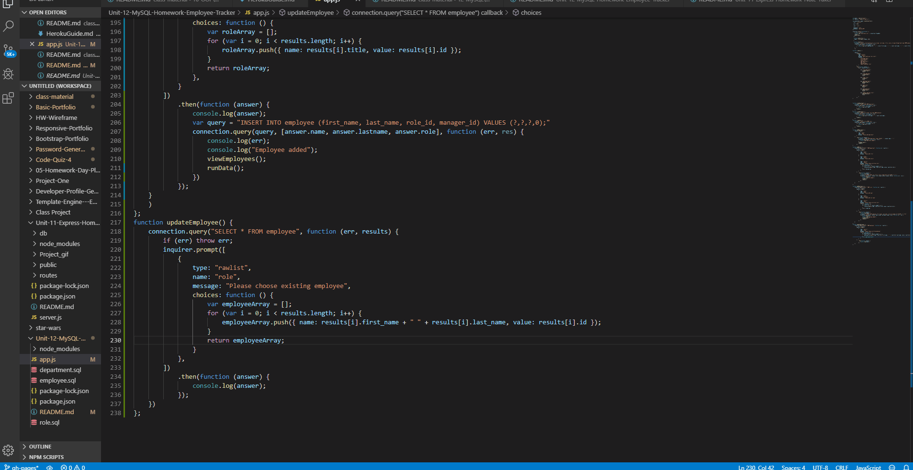
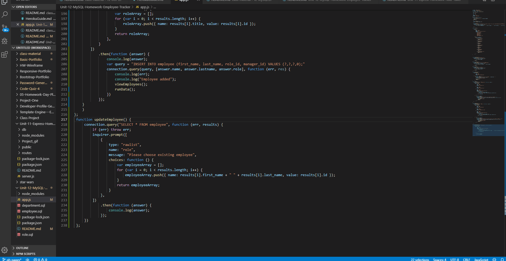
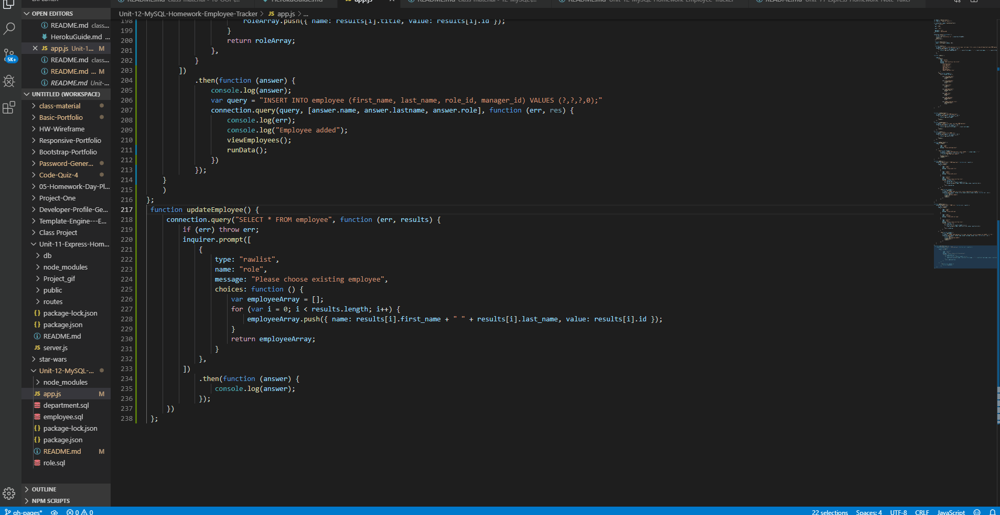
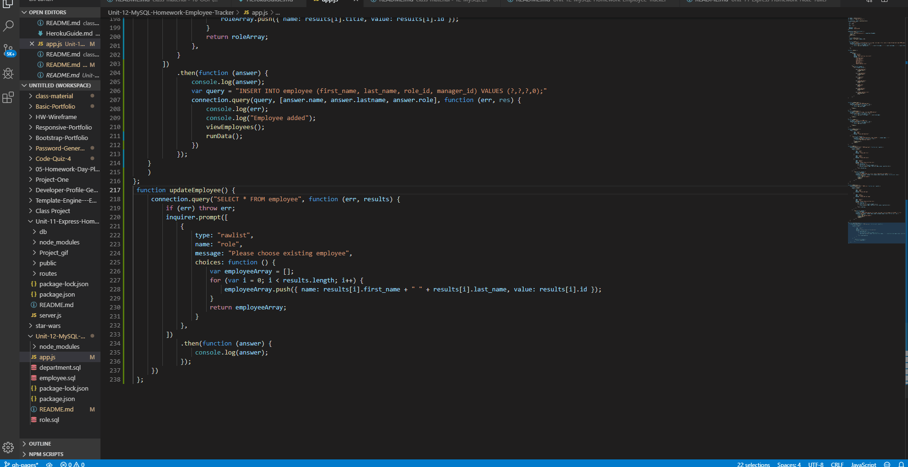
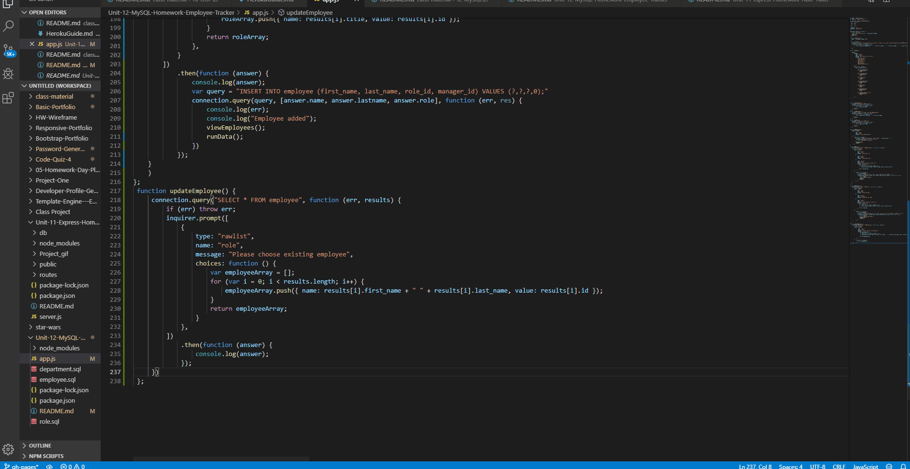

# Unit-12-MySQL-Homework-Employee-Tracker

A command-line application that allows the user to:

  * View departments, roles, employees

  

  * Add departments, roles, employees

  
  
  
  

  * Update employee roles

  
  